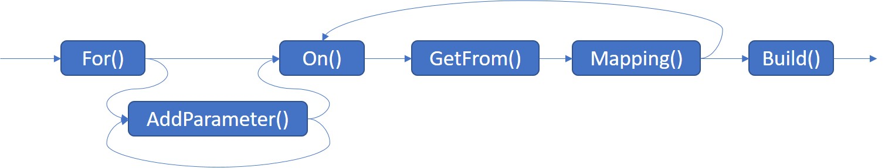

# Enunciado do Trabalho 3

**Data limite de entrega: ~~2~~ 7 de Junho**

**Objectivos**: Delegates, Genéricos e Prática com Iteradores _lazy_ (_yield generators_).

No seguimento do Trabalho 2 desenvolvido na biblioteca **Webao** pretende-se
dar suporte a tipos genéricos e operações _lazy_.

Todas as funcionalidades pedidas neste enunciado devem ser suportadas
**apenas na classe `WebaoDynBuilder`**.

## 1 -  _custom mattribute_ `Mapping`

Pretende-se que o _custom mattribute_ `Mapping` possa guardar o método responsável por
extrair o valor do _dto_ (e.g. uma função `GetArtistsList` que está
previamente definida em `DtoSearch`, ou noutra classe qualquer).
Esta utilização será alternativa à do segundo parâmetro do construtor de `Mapping`
referente ao grafo de propriedades que têm que ser acedidas para obter o resultado a retornar.
Assim a classe `Mappingattribute` passar a ter dois construtores:

```csharp
[AttributeUsage(AttributeTargets.Method, AllowMultiple = false)]
public class MappingAttribute : Attribute
{
    ...
    public MappingAttribute(Type dto, string path) {...}
    public MappingAttribute(Type dto) {...}
    public string With { set { ... } }
    ...
```

O utilizador poderá usar o _custom attribute_ `Mapping` da seguinte forma:

```csharp
[Get("...")]
[Mapping(typeof(DtoSearch), With = "Webao.Test.Dto.DtoSearch.GetArtistsList")]
List<Artist> Search(string name, int page);
```

Neste caso `GetArtistsList` é o nome do método da classe `DtoSearch` que faz: `return this.Results.ArtistMatches.Artist;`.

## 2 - Genéricos, API fluente e _delegates_

Pretende-se oferecer ao cliente da biblioteca **Webao** uma forma **alternativa** 
à configuração por _custom attributes_.
**ATENÇÃO** NÃO use _extension methods_ na implementação desta funcionalidade.

Assim a interface que especifica um Webao (e.g. `WebaoDynTrack`, `WebaoDynArtist, etc`)
passa a poder ser definida como no exemplo seguinte:

```csharp
interface WebaoDynArtist {
    Artist GetInfo(string name);
    List<Artist> Search(string name, int page);
}
```

A partir da interface anterior pode ser gerada uma instância de uma implementação
dinâmica através de:

```csharp
WebaoDynArtist webao = WebaoDynBuilder
    .For<WebaoDynArtist>("http://ws.audioscrobbler.com/2.0/")
    .AddParameter("format", "json")
    .AddParameter("api_key", "************")
    .On("GetInfo")
    .GetFrom("?method=artist.getinfo&artist={name}")
    .Mapping<DtoArtist>(dto => dto.Artist)
    .On("Search")
    .GetFrom("?method=artist.search&artist={name}&page={page}")
    .Mapping<DtoSearch>(dto => dto.Results.ArtistMatches.Artist)
    .Build(req);
```

Os métodos anteriores podem ser encadeados pela seguinte ordem sendo que o `For()` será
sempre o método inicial e o `Build()` a operação terminal:

 

Destes métodos o único que deve residir no `WebaoDynbBuilder` é o `For()`,
sendo que os restantes devem ser definidos em classes auxiliares.
Por facilidade, numa 1ª etapa poderá defini-los como métodos de instância de
`WebaoDynbBuilder` e posteriormente reorganizar o código.

Realize testes unitários para uma nova versão de cada um dos tipos Webao que
implementou nos testes unitários dos trabalhos anteriores, usando esta nova
forma de configuração.

**Não modifique** a infra-estrutura desenvolvida nos Trabalhos 1 e 2 que suporta esta funcionalidade via
 _custom attribute_. 
A mesma infra-estrutura deve ser partilhada e usada por ambos os meios de configuração.

## 3 - Sequências lazy

Pretendem-se construir serviços sobre os Webao que disponibilizem 
agregados de objectos de domínio.
Estes serviços podem ser customizados com uma instância de uma implementação
de `IRequest` com a qual são criadas as instâncias dos Webao auxiliares.

Por exemplo:

```csharp
class ServiceTracks
{
    private readonly WebaoTrack webao;
    public ServiceTracks() : this(new HttpRequest()) {}
    public ServiceTracks(IRequest req) {....}
    public IEnumerable<Track> TopTracksFrom(string country) {...}
}
```

Neste caso `TopTracksFrom()` deve retornar uma sequência **LAZY** com todas 
as músicas do _top tracks_ para o país dado, i.e. `country`.
Note que este método deve juntar numa única sequência _lazy_ as músicas obtidas 
das várias páginas de resultados da Web Api da Last.fm.

A mesma abordagem deve ser seguida para outros métodos de serviços que
agreguem numa única sequência os resultados paginados de outras Web API.

Realize um teste unitário que confirme o comportamento lazy destes métodos.

Para tal, instancie o serviço com uma implementação de `IRequest` que
contabilize o número de pedidos realizados.
Por exemplo, se os resultados do pedido de _top tracks_ forem retornados em
páginas de 20 elementos, então ao iterarmos sobre os 50 primeiros elementos
devolvidos por `TopTracksFrom()` devem ser desencadeados 3 pedidos.

Realize testes unitários para diferentes cenários.
